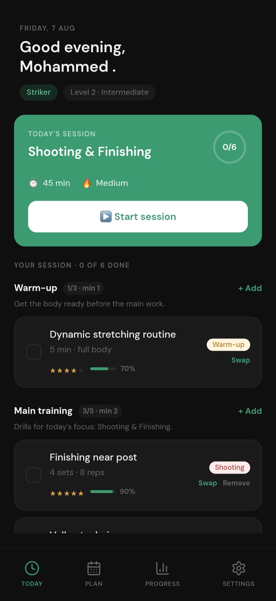
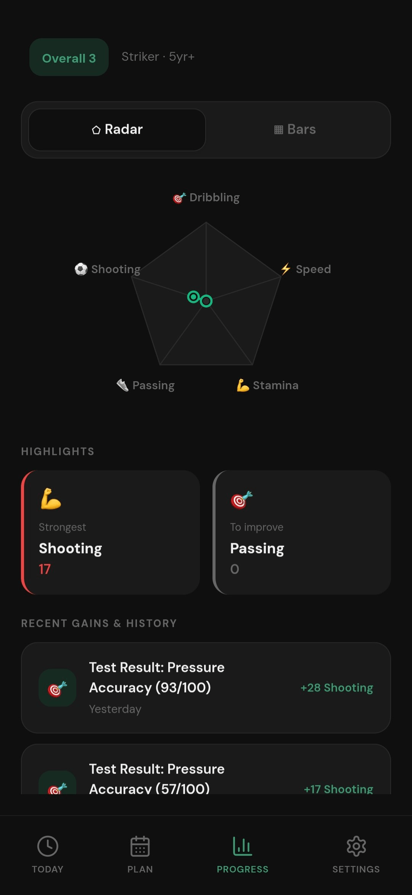
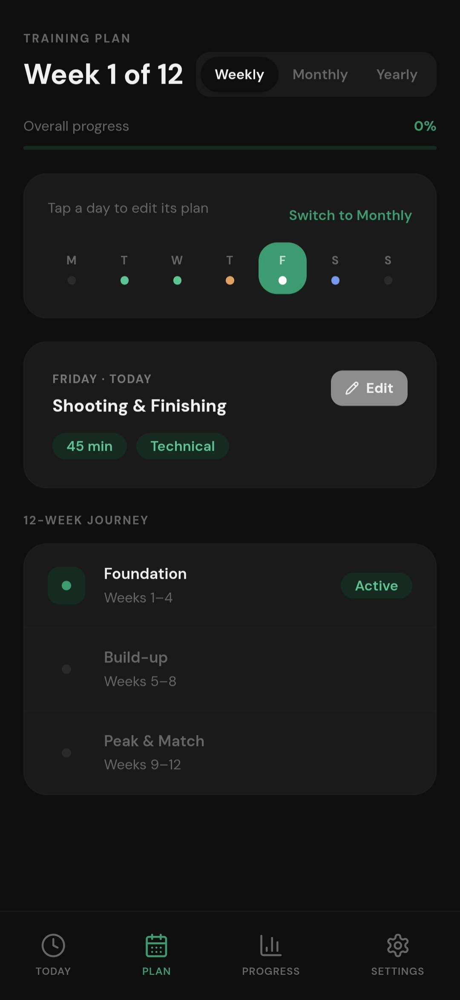

# Mini FPP

Mini FPP (Mini Football Performance Platform) is a simplified demo build showcasing the core concept of a larger project: a mobile app that builds a personalized football training plan and tracks skill progress through interactive tests and visual statistics.

> **Project status:** This is a simplified, early-stage version created to demonstrate the concept. The full project, **Football Performance Platform**, is currently under active development and will include the complete set of skill tests and features. This mini version is functional but not feature-complete.

## About This Project
I built Mini FPP because most players train based on guesswork, repeating the same drills without really knowing which skills they're weak in or how they're actually progressing. The idea is to take that randomness out of training, assess a player's real skill level through interactive tests, then build a personalized plan around the results and track development over time with real data instead of assumptions. This project let me explore building a full assessment-and-scoring system alongside a personalized plan engine in a mobile app context.

## Screenshots

| Home | Skill Assessment | Progress Analytics |
|---|---|---|
|  |  |  |

## Tech Stack
 * React
 * TypeScript
 * CSS

## Features
 * Personalized onboarding that tailors a training plan to position, experience, goal, and weekly availability.
 * Interactive skill assessment tests with instant scoring (shooting implemented; more categories in progress).
 * Daily session tracker with warm-up and main training drills, drill swapping, and progress checkboxes.
 * Weekly, monthly, and yearly training plan views with editable daily sessions.
 * Visual progress analytics with radar and bar charts, skill highlights, and test history.
 * Local notifications for daily training reminders, streak alerts, and weekly reviews.
 
## Technical Details
 * Local Auth Only: Account data resides strictly on the device.
 * 100% Local Storage: No remote server; full data privacy.